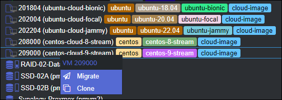

# Creating Cloud Images for ProxMox

This script is if you want to:

> Use a pre-configured Cloud Images in your ProxMox Hypervisor.

The concept is that you can either:

1. Create a VM, attach an `.iso` file and go through the installation of the operating system, then install software, harden and configure it - which often takes :30 minutes or more.
1. "Clone" a cloud image template, and within :15 seconds or so, be able to log into your new VM, which already has some configuration (and you can customize to your needs and add more)

This second option is what these scripts are about. They go out and download the cloud image for the operating system, and then create a ProxMox template VM that you can clone to create new VM's.

> 

This started off with being for Ubuntu-only. In January 2023 this repository was renamed, and support for other operating systems were added, since the process is almost identical for other distributions.

## Features

These scripts will configure one cloud image at a time that has at least some basic configuration in place, including:

- Hostname and DNS domain search name.
- Static IP address or DHCP.
- Non-root account that has `sudo` privilege.
- Your SSH keys added to `~/.ssh/authorized_keys` from www.launchpad.net (a free, public place to store your SSH public keys)

So, it's just a few notches more-configured than if you installed the Ubuntu OS from scratch. These cloud images are significantly smaller and stand up very quickly. You clone your new VM, it's up and available in well under a minute, and you can immediately SSH in with your SSH keys. This is very similar to the Big Box cloud providers.

## Getting Started

As support has grown for other operating systems, each OS has it's own folders with it's own script, and it's own README to account for the nuances of that particular operating system. *"Couldn't this be one script?"* you might ask. Technically yes, but there is a lot of nuance and branching logic.

For example, with CentOS, in 8 Stream the SHA256 hashes are in a CHECKSUMS file with one line per filename, with a colon, and then then the hash. In 9 Stream and higher, there is a dedicated `<qcow-filename>.sha256sum` filename that has just the SHA256 hash for that particular file. There is this kind of branching logic and nuance for different versions within a distro. If you put this all into one script, it would probably be unweildly and difficult to maintain. If you disagree, feel free to use these scripts and run with it however you'd like!

For specific Linux distributions, see the specific folders:

- ** [Ubuntu 18.04-22.04](./ubuntu/)** - 16.04 is out of support, so has been dropped here.
- ** [CentOS 8-Stream, and 9-Stream only](./centos/)** - v7 doesn't seem to have cloud image support, and everyone says not to use 8-Stream, but it is supported, so support is included here.

## More Information

I was initially inspired by this TechnoTim video:

> **[https://www.youtube.com/watch?v=shiIi38cJe4](https://www.youtube.com/watch?v=shiIi38cJe4)**

and blog post:

> **[https://docs.technotim.live/posts/cloud-init-cloud-image/](https://docs.technotim.live/posts/cloud-init-cloud-image/)**

I basically built-out a single script that does these things, and few other steps. This page from the ProxMox documentation was very helpful too:

> https://pve.proxmox.com/pve-docs/qm.1.html

As was the `virt-customize` command (you need to install `libguestfs-tools` first) which allows you to modify configuration of an offline VM disk:

> https://libguestfs.org/virt-customize.1.html
